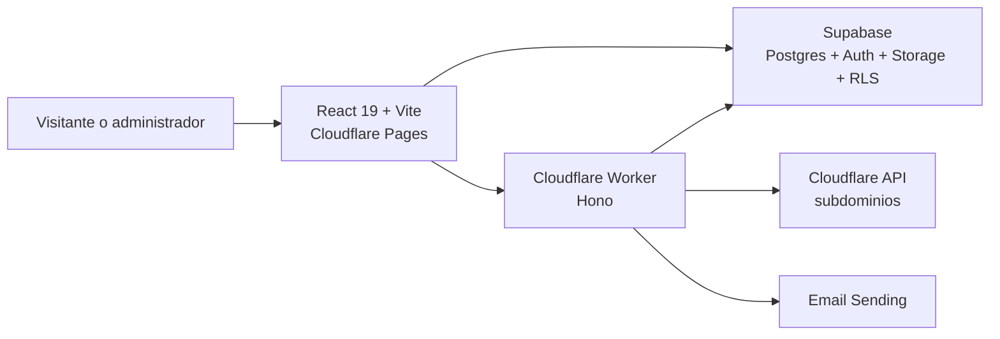

# Especificación vigente — EventPass VE

**Estado:** para revisión · **Última actualización:** 2026-08-17

> La referencia técnica de este documento es el código, las migraciones de
> Supabase y `CLAUDE.md`. Las propuestas históricas bajo `docs/` pueden describir
> una arquitectura anterior y no deben tomarse como fuente de implementación.

## 1. Propósito y alcance

EventPass VE es un SaaS multi-tenant para organizaciones que realizan eventos
en Venezuela. Gestiona el ciclo de registro, cobro manual, acreditación y
operación administrativa, con una plataforma central para gestionar clientes y
suscripciones.

El producto está en producción en `https://eventosfacil.net`.

## 2. Usuarios y permisos

| Usuario | Capacidades |
| --- | --- |
| Visitante | Consulta organización/eventos publicados, se registra y carga comprobante. |
| Staff | Opera datos permitidos de su organización. |
| Admin / owner | Gestiona organización, eventos, asientos, pagos y acreditación. |
| Superadmin | Gestiona clientes, planes, cobros y equipo; puede operar temporalmente como un cliente. |

Los roles de organización son `owner`, `admin` y `staff`. El superadmin es un
rol independiente de plataforma (`platform_admins`).

## 3. Flujos funcionales

1. **Alta de organización.** El usuario crea cuenta, confirma el correo y crea
   su organización. Se valida el slug y se aprovisiona su subdominio.
2. **Configuración.** Un admin crea/edita/publica eventos, medios de pago y
   planos: asientos para foros y una cuadrícula inicial de stands para
   exposiciones. Cada stand puede asignarse a una empresa, con contacto y
   notas internas visibles desde el plano.
3. **Programa y registro para octubre.** Un programa reúne uno o más eventos
   relacionados (por ejemplo, foro y exposición); el registro público perfila
   al participante y permite emitir pases con acceso por evento, día, sesión o
   zona. La venta continúa fuera de la plataforma en esta versión.
4. **Registro y pago.** El visitante se registra, reserva asiento de forma
   atómica si corresponde y recibe un enlace para cargar el comprobante.
5. **Verificación.** Un admin confirma o rechaza el comprobante. La
   confirmación habilita la credencial QR y dispara la notificación.
6. **Operación en sitio.** El personal hace check-in con QR o búsqueda y puede
   imprimir gafetes.
7. **Suscripción.** La organización solicita un plan y adjunta comprobante; el
   superadmin lo aprueba o rechaza. La base de datos aplica los límites del plan.

## 4. Arquitectura

- **Frontend:** React 19, TypeScript, Tailwind CSS v4, React Router y rutas
  cargadas de forma diferida.
- **Backend:** un Worker Hono para correo, aprovisionamiento de dominios,
  invitaciones, acciones privilegiadas y trabajos cron.
- **Datos:** Supabase Postgres es la fuente de verdad de autorización; RLS aísla
  por `organization_id`.
- **Almacenamiento:** buckets privados `comprobantes` y `subs`.
- **Despliegue:** frontend por GitHub Actions al tocar `frontend/**` en `main`;
  Worker y migraciones con proceso manual.

## 5. Modelo de dominio

- **Plataforma:** `organizations`, `memberships`, `subscriptions`, `plans`,
  `platform_admins`, `platform_payment_methods`, `subscription_payments`.
- **Eventos:** `events`, `payment_methods`, `seats`, `registrations`,
  `event_programs`, `program_events`, `event_sessions`, `event_zones`,
  `people`, `event_participations`, `passes`, `pass_entitlements`,
  `venue_maps`, `venue_map_elements` y `booth_assignments`.
- **Auditoría:** `admin_actions`, `email_log`.

Estados relevantes:

| Entidad | Estados |
| --- | --- |
| Evento | `draft`, `published`, `closed`, `archived` |
| Registro | `pending_payment`, `payment_submitted`, `confirmed`, `rejected` |
| Asiento | `available`, `reserved`, `confirmed` |
| Stand | `available`, `reserved`, `assigned`, `blocked` |
| Asistencia | `no_attendance`, `checked_in` |

## 6. Seguridad y reglas críticas

- Toda entidad de tenant contiene `organization_id`; RLS y membresías controlan
  el acceso.
- Los flujos que requieren elevación usan RPC `security definer`, por ejemplo:
  `create_organization`, `register_with_seat`, `submit_comprobante`,
  `get_registration_by_token`, `get_credential_by_token` y los RPC de billing.
- El Worker conserva el service role y valida JWT o `CRON_SECRET` antes de sus
  acciones privilegiadas.
- Triggers de base de datos aplican los límites de eventos y registros del plan.
- No se debe relajar RLS para resolver una limitación: se añade una RPC validada
  o una operación del Worker.

## 7. Superficies del producto

- Público: `/`, `/registro`, `/e/:eventId`, `/comprobante/:token`,
  `/credencial/:token`.
- Cuenta: `/crear-cuenta`, `/bienvenida`, `/definir-clave`.
- Administración: `/admin`, `/admin/eventos`, `/admin/asientos/:eventId`,
  `/admin/stands/:eventId`, `/admin/programas`, `/admin/checkin`,
  `/admin/acreditacion`, `/admin/suscripcion`, `/superadmin`.
- Registro por programa: `/p/:programId/registro`.
- Worker: salud, notificaciones de registro/confirmación, dominio del tenant,
  alta de clientes y cron manual protegido.

## 8. Operación y calidad

- No hay suite de pruebas automatizada. Los gates actuales son TypeScript y
  `oxlint` en frontend.
- Las migraciones se versionan en `infra/supabase/migrations/`, deben ser
  idempotentes y se aplican manualmente en el SQL Editor de Supabase.
- Todo trabajo que cambie comportamiento, arquitectura o decisiones debe
  actualizar este documento y `task.md`.

## 9. Riesgos y decisiones pendientes

1. Consolidar o retirar documentación heredada que contradiga el stack vigente.
2. Incorporar pruebas automatizadas para los flujos críticos de registro,
   comprobantes, RLS y billing.
3. Documentar y validar explícitamente el alcance offline/PWA de check-in; no
   hay evidencia de un service worker dedicado en el repositorio actual.
4. Formalizar el checklist de release del Worker y de migraciones manuales.
5. Completar el editor visual de exposición: dimensiones, pasillos y zonas.
   El plano ya permite crear una cuadrícula y asignar empresas a sus stands.

## 10. Criterios de aceptación de esta especificación

- Describe producto, usuarios, flujos, arquitectura y controles vigentes.
- Permite ubicar cada flujo entre frontend, Worker y Supabase.
- Es el punto de partida para cambios de alcance y para el backlog de Notion.
