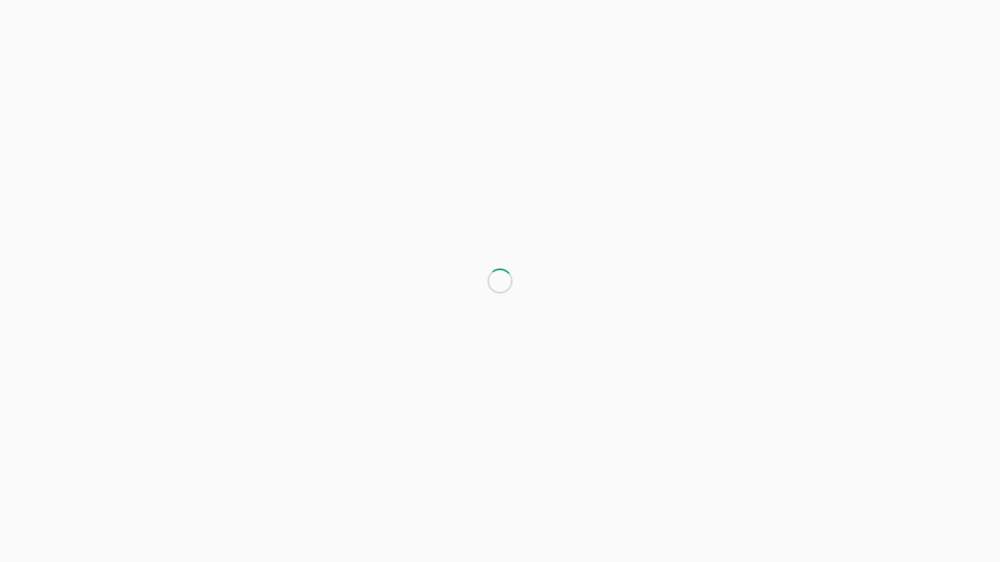
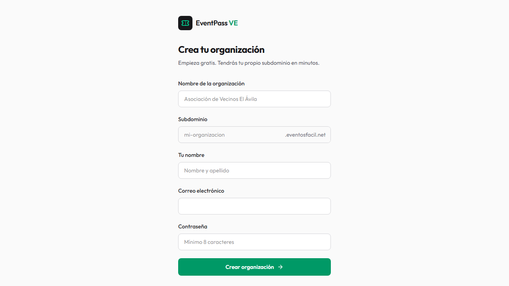
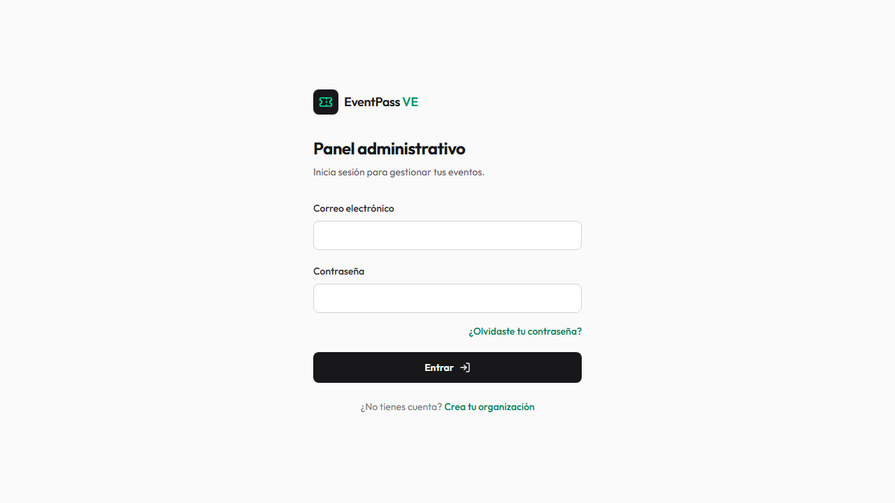

# Guía simple de demo y pruebas — EventPass VE

Esta guía está hecha para dos personas no técnicas:

- **Partner comercial:** muestra el valor de la plataforma a un posible cliente.
- **Equipo de eventos:** comprueba que las tareas del día a día se sienten claras y naturales.

No hace falta conocer programación. Solo sigan los pasos en orden y marquen el resultado. La demo ideal dura **25 a 30 minutos**. El documento también sirve como guía de pruebas para que el cliente pueda recorrer el sistema sin conocimientos técnicos.

## Enlaces para la demo

Usen siempre el dominio oficial: **https://eventosfacil.net**.

### Demo preparada para la presentación

| Dato | Valor |
| --- | --- |
| Organización preparada | `Asociación Demo` |
| Acceso administrativo | [Entrar a la demo](https://eventosfacil.net/admin/login) |
| Sitio público del tenant | [Abrir sitio demo](https://expopetroleo20226.eventosfacil.net/) |
| Evento principal de exposición | `Expo Energia 2026` |
| Evento principal de foro | `Foro Energético 2026` |

Las credenciales de esta cuenta se guardan solamente en `.env.demo.local` del
equipo de preparación. No deben pegarse en la presentación, el correo ni este
documento. El subdominio puede tardar unos minutos en estar disponible tras su
creación; mientras tanto, el acceso administrativo se hace por el enlace
principal de arriba.

| Para qué sirve | Enlace |
| --- | --- |
| Página de presentación | [Abrir inicio](https://eventosfacil.net/) |
| Crear una organización | [Crear organización](https://eventosfacil.net/crear-cuenta) |
| Entrar al panel | [Iniciar sesión](https://eventosfacil.net/admin/login) |
| Recuperar contraseña | [Recuperar contraseña](https://eventosfacil.net/recuperar-clave) |
| Panel del organizador | [Abrir panel](https://eventosfacil.net/admin) |
| Eventos | [Abrir eventos](https://eventosfacil.net/admin/eventos) |
| Programas | [Abrir programas](https://eventosfacil.net/admin/programas) |
| Patrocinantes | [Abrir patrocinantes](https://eventosfacil.net/admin/patrocinantes) |
| Equipo operativo | [Abrir equipo](https://eventosfacil.net/admin/equipo-operativo) |
| Acreditación | [Abrir acreditación](https://eventosfacil.net/admin/acreditacion) |
| Check-in | [Abrir check-in](https://eventosfacil.net/admin/checkin) |
| Control de ingresos | [Abrir control](https://eventosfacil.net/admin/checkin/control) |
| Suscripción | [Abrir suscripción](https://eventosfacil.net/admin/suscripcion) |

### Enlaces directos de la demostración preparada

| Enlace específico | Abrir |
| --- | --- |
| Registro público de Expo Energia 2026 | [Abrir registro](https://eventosfacil.net/e/276e4d25-b107-4393-9530-542db8ed03a3) |
| Agenda pública de Expo Energia 2026 | [Abrir agenda](https://eventosfacil.net/e/276e4d25-b107-4393-9530-542db8ed03a3/agenda) |
| Registro del programa Foro + Expo | [Abrir registro](https://eventosfacil.net/p/5bef4079-0345-4468-aad7-555483345cc3/registro) |
| Plano público de exposición | [Abrir plano público](https://eventosfacil.net/expo/276e4d25-b107-4393-9530-542db8ed03a3/plano) |
| Administración de Expo Energia 2026 | [Abrir evento](https://eventosfacil.net/admin/eventos/276e4d25-b107-4393-9530-542db8ed03a3/administrar) |
| Agenda del organizador | [Abrir agenda](https://eventosfacil.net/admin/agenda/276e4d25-b107-4393-9530-542db8ed03a3) |
| Expositores | [Abrir expositores](https://eventosfacil.net/admin/expositores/276e4d25-b107-4393-9530-542db8ed03a3) |
| Plano de exposición | [Abrir plano](https://eventosfacil.net/admin/stands/276e4d25-b107-4393-9530-542db8ed03a3) |
| Plano de foro con IA | [Abrir foro](https://eventosfacil.net/admin/asientos/47ad0375-24dd-4f40-80c0-500f4362767c) |

## Así se ve el inicio



## Así se crea una organización



## Así se entra al panel



## Antes de comenzar

Pedir al administrador de EventPass:

- El enlace del sitio de demostración.
- Un usuario y clave de demostración para el panel.
- Los eventos preparados `Expo Energia 2026` y `Foro Energético 2026`.
- Un participante de prueba ya registrado, con su credencial/QR.

Usen solo datos de demostración. Si van a crear algo nuevo, comiencen el nombre con `DEMO -`. No eliminen eventos, empresas ni participantes existentes.

> **Importante:** no compartan la clave en diapositivas, correos o este documento. El administrador debe entregarla por un canal privado y cambiarla después de la presentación.

Si algo no funciona, tomen una captura de pantalla y escriban: “qué estaba haciendo”, “qué esperaba ver” y “qué ocurrió”. Eso es suficiente para que el equipo técnico lo revise después.

## El recorrido en una mirada

```text
Panel → Evento → Agenda y planos → Registro → Acreditación
     → Expositores → Portal expositor → Escaneo de visitantes
```

## Parte A — Prueba para el partner comercial

El objetivo no es explicar cada botón: es ayudar al cliente a imaginar su propio evento. Hablen de beneficios y usen ejemplos cercanos a su negocio.

### 1. Entrada y panel principal — 2 minutos

1. Abran el enlace recibido e inicien sesión.
2. Entren al **Panel**.
3. Muestren que desde allí se puede ir a Eventos, Acreditación, Check-in, Patrocinantes y Suscripción.

**Frase sugerida:** “Aquí el organizador ve y gestiona las partes principales de su evento en un solo lugar.”

**¿Pasó?** El panel abrió y los botones llevan a sus secciones: ☐ Sí ☐ No

### 2. Crear y preparar un evento — 4 minutos

1. Entren en **Eventos**.
2. Abran `Expo Energia 2026`. Para el plano de foro usen el evento `Foro`.
3. Muestren los datos básicos: nombre, fecha, sede y estado.
4. Entren a **Agenda** y muestren una charla, un taller o un receso.
5. Si hay una exposición, abran **Expositores** o el **Plano**.

**Frase sugerida:** “El organizador puede preparar el evento antes de abrir inscripciones: agenda, espacios y aliados comerciales.”

**¿Pasó?** Se guardaron los datos y se puede volver a abrir el evento: ☐ Sí ☐ No

### 3. Registro de un asistente — 4 minutos

1. Desde el evento o programa, abran el enlace de **registro público** en otra pestaña.
2. Completen el formulario con un correo de demostración.
3. Si el evento usa pago por transferencia, muestren dónde se carga el comprobante. No es necesario cargar uno real durante una presentación.
4. Vuelvan al panel y expliquen que el organizador puede revisar la inscripción antes de confirmarla.
5. Revisen el correo recibido:
   - si el evento es **gratuito**, debe decir que el registro está confirmado y ofrecer **Ver mi credencial**, sin mencionar pago ni comprobante;
   - si el evento es **con pago**, debe indicar que la plaza está reservada y ofrecer **Cargar mi comprobante**;
   - después de aprobar un pago, el segundo correo debe decir **Pago confirmado** y ofrecer la credencial.

**Frase sugerida:** “El asistente se registra desde su teléfono; el equipo ve el proceso y controla la confirmación.”

**¿Pasó?** El registro y el correo muestran el paso correcto para la modalidad: ☐ Sí ☐ No

> Si el correo no aparece en dos minutos, revisen spam y usen **Reintentar correo**. No continúen la demo si un evento gratuito menciona pagos: registren la incidencia y utilicen el participante preparado.

### 4. Credencial y entrada al evento — 4 minutos

1. Abran **Acreditación**.
2. Busquen al participante de demostración por nombre o correo.
3. Muestren su credencial y expliquen que se puede imprimir.
4. Abran **Check-in** y demuestren el ingreso manual buscando a la misma persona.
5. Si hay un teléfono disponible, lean el QR de la credencial. Si no, aclaren que la búsqueda manual es la alternativa normal.

**Frase sugerida:** “En la puerta, el equipo puede escanear la credencial o buscar por nombre. Así el ingreso sigue funcionando incluso si la cámara no se usa.”

**¿Pasó?** El sistema reconoce al participante y muestra un resultado claro: ☐ Sí ☐ No

### 5. Valor comercial: patrocinantes y expositores — 5 minutos

1. Entren en **Patrocinantes**.
2. Muestren un paquete de ejemplo: por ejemplo, Oro, Plata o A la medida.
3. Abran un acuerdo de demostración y señalen que se pueden anotar monto, estado de pago y entregables.
4. Entren en **Expositores** y muestren una empresa asignada a un stand en el plano.
5. Si existe un plano publicado, abran la vista pública y señalen que el visitante identifica dónde está cada empresa.

**Frase sugerida:** “Además de inscripciones, el cliente puede ordenar lo que vende y promete a patrocinantes y expositores: espacios, entregables y seguimiento.”

**¿Pasó?** Se ve claramente la empresa, su acuerdo o su stand: ☐ Sí ☐ No

### 6. Portal del expositor y visitantes del stand — 4 minutos

1. En **Expositores**, abran el portal de una empresa asignada al evento.
2. Muestren su página de inicio: perfil público, personal, pendientes, actividades y pagos.
3. Entren en **Escanear visitantes**.
4. Seleccionen el stand y abran la cámara. También se puede usar un lector USB o pegar el contenido del QR para una prueba sin cámara.
5. Escaneen una credencial válida del mismo evento.
6. Comprueben que se registra la visita y aparecen nombre, empresa, cargo y correo disponibles.
7. Escaneen de nuevo después de 10 segundos: debe aumentar el contador de visitas. Una lectura accidental inmediata no se duplica.
8. Muestren las métricas y la descarga CSV.

**Frase sugerida:** “El expositor puede dejar un equipo abierto en el stand y registrar quién lo visitó, cuántas veces regresó y descargar sus contactos.”

**¿Pasó?** La visita aparece con sus datos y el contador se actualiza: ☐ Sí ☐ No

### 7. Cierre de la presentación — 2 minutos

Pregunten al cliente:

1. “¿Qué parte de su evento le quitaría más trabajo?”
2. “¿Qué tipo de asistentes, expositores o patrocinantes maneja hoy?”
3. “¿Qué necesitaría ver en una siguiente sesión usando un evento real?”

No prometan funciones que no se hayan mostrado. Anoten las preguntas para validar el alcance después.

## Parte B — Prueba para el equipo de eventos

### Control D1 — Registro y comunicaciones antes de la demo

Realicen esta comprobación con dos correos controlados antes de entregar el sistema al cliente:

| Prueba | Qué hacer | Debe ocurrir |
| --- | --- | --- |
| D1-01 Gratuito | Registrar un participante en un evento gratuito. | Registro confirmado, correo con credencial y cero referencias a pago o comprobante. |
| D1-02 Pago pendiente | Registrar otro participante en un evento con pago. | Plaza reservada, métodos del evento correcto y enlace para cargar el comprobante. |
| D1-03 Pago aprobado | Cargar y aprobar el comprobante. | Correo “Pago confirmado”, credencial válida y registro visible en acreditación. |
| D1-04 Reintento | Reenviar desde el aviso o desde el panel. | El nuevo intento queda aceptado sin crear otro participante. |
| D1-05 Entrada | Buscar en acreditación y realizar check-in manual o por QR. | El mismo participante aparece en el evento correcto y el ingreso queda registrado. |

Anoten hora, evento, modalidad y resultado. No escriban tokens ni contraseñas en esta guía.

Esta parte sirve para confirmar que el recorrido es cómodo para quien organiza y opera el evento.

### 1. Organizar un evento

1. Inicien sesión y entren en **Eventos**.
2. Abran un evento de demostración.
3. Comprueben que encuentran sin ayuda: **Agenda**, **Plano/Asientos**, **Expositores**, **Personal**, **Acreditación** y **Check-in**.
4. Cambien un dato sencillo en el borrador, guarden y recarguen la página.

**Resultado esperado:** el cambio sigue allí y saben cómo volver al evento.

☐ Claro ☐ Confuso ☐ No funcionó

### 2. Preparar la agenda

1. Abran **Agenda**.
2. Creen una actividad de prueba: `DEMO - Bienvenida`.
3. Indiquen hora de inicio y fin, y guarden.
4. Si hay ponentes o patrocinantes de prueba, asígnenlos.

**Resultado esperado:** la actividad aparece en la agenda y se entiende cómo editarla.

☐ Claro ☐ Confuso ☐ No funcionó

### 3. Organizar el espacio

Elijan solo el tipo que aplica a su evento:

- **Foro:** entren a **Asientos**, elijan el ejemplo **Foro 120** y pulsen **Crear propuesta**. Expliquen que la IA entiende la solicitud y EventPass calcula un plano válido antes de mostrarlo. Revisen la capacidad, pasillos y accesos; apliquen la propuesta sólo en el evento de demostración. Después muevan una silla libre para mostrar que el resultado sigue siendo editable.
- **Exposición:** entren a **Plano**, identifiquen los stands y confirmen que se entiende dónde está cada empresa. Para mostrar IA, usen sólo un plano de demostración vacío: carguen PNG, JPG o PDF, pulsen **Analizar con IA**, revisen la propuesta y aplíquenla únicamente si la correlación visual es adecuada.

**Resultado esperado:** el plano se entiende sin tener que conocer términos técnicos.

☐ Claro ☐ Confuso ☐ No funcionó

### 4. Gestionar un expositor o patrocinante

1. En **Expositores**, localicen una empresa de prueba y su stand.
2. En **Patrocinantes**, localicen un acuerdo de prueba y revisen paquete, pago y entregables.
3. Respondan: “¿podría saber rápidamente qué se le prometió a esta empresa y qué falta por entregar?”

**Resultado esperado:** la respuesta debe ser sí, sin revisar varios lugares.

☐ Sí ☐ No ☐ Necesita mejoras

### 5. Recibir al participante el día del evento

1. Entren en **Acreditación** y busquen `DEMO Participante`.
2. Abran su credencial; si está autorizado, envíen una impresión de prueba.
3. Entren en **Check-in**.
4. Prueben primero la búsqueda manual por nombre y luego el QR si disponen de cámara.
5. Intenten ingresar a la misma persona una segunda vez para comprobar que el aviso se entienda.

**Resultado esperado:** se sabe en segundos si la persona puede entrar, ya entró o necesita ayuda.

☐ Claro ☐ Confuso ☐ No funcionó

### 6. Prueba desde teléfono

1. Abran el panel en un teléfono.
2. Abran el menú y entren a Eventos, Acreditación y Check-in.
3. Busquen al participante de demostración.

**Resultado esperado:** se puede trabajar sin que el texto o los botones queden fuera de la pantalla.

☐ Claro ☐ Confuso ☐ No funcionó

### 7. Captar visitantes desde el stand

1. Abran el portal de un expositor del evento.
2. Entren en **Escanear visitantes** y seleccionen el stand correcto.
3. Escaneen el QR de una credencial válida.
4. Comprueben nombre, empresa, cargo, correo, hora y contador.
5. Repitan después de 10 segundos y descarguen el CSV.

**Resultado esperado:** cada visita real queda registrada y una lectura accidental inmediata no crea un duplicado.

☐ Claro ☐ Confuso ☐ No funcionó

## Hoja breve de resultados

Completar al terminar:

| Tema | Resultado | Comentario simple |
| --- | --- | --- |
| Entrar al panel | ☐ Bien ☐ Revisar | |
| Preparar evento y agenda | ☐ Bien ☐ Revisar | |
| Registro de asistente | ☐ Bien ☐ Revisar | |
| Credencial y check-in | ☐ Bien ☐ Revisar | |
| Expositores y plano | ☐ Bien ☐ Revisar | |
| Patrocinantes | ☐ Bien ☐ Revisar | |
| Portal del expositor y visitantes | ☐ Bien ☐ Revisar | |
| Uso desde teléfono | ☐ Bien ☐ Revisar | |

### Cómo reportar algo que se debe mejorar

Escriban una sola línea siguiendo este modelo:

> En **[pantalla]**, al intentar **[acción]**, esperaba **[resultado]**, pero ocurrió **[resultado real]**.

Ejemplo:

> En Check-in, al buscar a Ana Pérez, esperaba ver si podía entrar, pero no entendí el mensaje que apareció.

## Para el lunes

- Hagan una sola pasada completa el día anterior.
- Usen un evento con agenda, participante, patrocinante y expositor ya preparados; evita esperas durante la reunión.
- Para la presentación, privilegien el recorrido de la Parte A. La Parte B se usa después para recoger comentarios del equipo de eventos.
- Si una función no está lista o no es parte del evento del cliente, no la abran durante la demo. Es mejor una historia corta y fluida que mostrar todas las pantallas.

## Actualización: pantalla pública de agenda y evaluación de cliente

La pantalla pública de agenda ya se puede configurar desde **Agenda → Pantalla pública**. Antes de probarla, active **Publicar esta pantalla** y guarde.

El organizador puede ajustar:

- Título, color principal, color de fondo y color de texto.
- Fuente: Outfit, Arial, Georgia o monoespaciada tipo tablero.
- Tamaño de lectura: compacto, normal o grande.
- Visibilidad de actividad en curso, próxima actividad, tabla de agenda y patrocinantes.
- Cintillo con mensaje, logos y nombres de patrocinantes.

Para la prueba pública:

1. Cree o ajuste una actividad con fecha, hora y escenario.
2. Abra **Ver agenda pública** desde Agenda.
3. Verifique selector de fecha, reloj, actividad actual/próxima y el cintillo.
4. Cambie una hora o marque la actividad como cancelada y confirme el cambio en la pantalla pública.
5. Complete la ficha de incidencia del documento Word `Guia_Pruebas_Cliente_Potencial_EventPass.docx` si algo no se entiende o falla.

La guía Word orientada al cliente potencial contiene un recorrido de todas las áreas activas, criterios de resultado y tres fichas de reporte de incidencias para completar durante la prueba.
