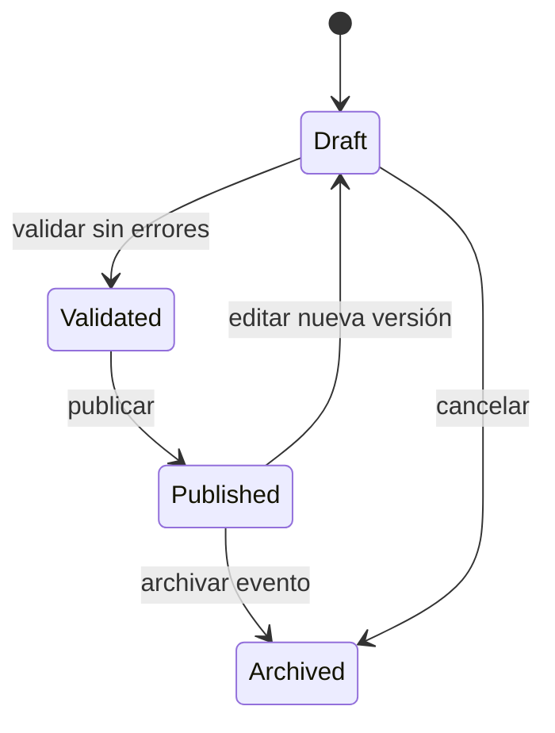

# Especificación técnica — Planificador de exposiciones interactivo

**Versión:** 1.0  
**Estado:** listo para implementar  
**Objetivo:** construir un editor web 2D de planos para exposiciones y una vista pública interactiva de consulta. La experiencia funcional se inspira en productos como ExpoFP —diseño de stands, disponibilidad, búsqueda, filtros y reservas—, sin copiar su interfaz, marca, código ni activos.

## 1. Principios de producto

El producto permite diseñar un plano de recinto y operar una exposición desde ese plano:

- El organizador crea y modifica zonas, stands, pasillos, accesos y servicios.
- Cada stand se puede asociar a un expositor, estado comercial y reglas de precio.
- El visitante explora el plano en móvil o escritorio, busca expositores, filtra y abre la ficha del stand.
- El plano es una fuente de verdad: no se dibuja una versión para administración y otra para visitantes.

### Fuera de alcance de la primera versión

- Modelado arquitectónico CAD, paredes paramétricas, habitaciones y mobiliario residencial.
- Renderizado 3D, realidad aumentada y rutas interiores con posicionamiento en tiempo real.
- Checkout y pago en línea de stands. Diseñar las interfaces para añadirlo después, pero no implementarlo en el MVP.
- Colaboración en tiempo real simultánea.

## 2. Arquitectura recomendada

### Stack

| Capa | Decisión |
|---|---|
| Frontend | React 18+ y TypeScript estricto |
| Editor gráfico | `react-konva` + `konva` |
| Estado local | Zustand con slices y `immer` opcional |
| UI | Tailwind CSS + componentes existentes del proyecto |
| Persistencia | API existente; PostgreSQL/Supabase si se necesita una referencia |
| Validación | Zod, tanto en el cliente como en el servidor |
| Exportación | JSON nativo; PNG para previsualización; PDF mediante un servicio o cliente controlado |
| Pruebas | Vitest + React Testing Library; Playwright para flujos críticos |

No incorporar PixiJS, Fabric, Three.js ni tldraw en esta fase. No mezclar motores de canvas.

### Separación de módulos

```text
src/features/floorplan/
  domain/          tipos, reglas de negocio, geometría y validadores puros
  editor/          Stage de Konva, capas, herramientas y atajos
  public-map/      visor de solo lectura para asistentes
  components/      paneles, paleta, inspector, leyenda y diálogos
  stores/          Zustand: selección, historial, viewport y documento
  api/             serialización, consultas y mutaciones
  exporters/       PNG, JSON y plantilla para PDF
  tests/
```

Mantener el documento de plano separado del estado efímero de interfaz. Nunca guardar objetos de Konva, referencias DOM, selección temporal o coordenadas de viewport dentro del documento persistente.

## 3. Roles y permisos

| Rol | Permisos |
|---|---|
| `platform_admin` | administra tenants, plantillas globales y auditoría |
| `event_admin` | crea evento, plano, zonas, stands, precios, publicación y asignaciones |
| `event_editor` | edita el plano; no publica ni modifica reglas comerciales |
| `sales_agent` | consulta, reserva/asigna stands autorizados; no altera geometría |
| `exhibitor` | ve y completa el perfil de su propio stand; no mueve elementos |
| `attendee` | consulta el mapa público y directorio |

Toda petición deberá comprobar `tenant_id`, `event_id` y permiso en servidor. No confiar en que ocultar un botón en el frontend sea control de acceso.

## 4. Modelo de datos

Usar unidades lógicas del plano (`plan units`) y una escala explícita. Ejemplo inicial: `1 unidad = 0,1 metros`. Las coordenadas del canvas no son píxeles de pantalla.

```ts
export type ElementType =
  | 'booth'
  | 'aisle'
  | 'entrance'
  | 'exit'
  | 'stage'
  | 'service'
  | 'safety_zone'
  | 'label'
  | 'wall'

export type BoothStatus =
  | 'available'
  | 'reserved'
  | 'sold'
  | 'blocked'
  | 'sponsor'

export interface RectGeometry {
  kind: 'rect'
  x: number
  y: number
  width: number
  height: number
  rotation: number
}

export interface PolygonGeometry {
  kind: 'polygon'
  points: Array<{ x: number; y: number }>
}

export interface PlanElement {
  id: string
  type: ElementType
  layerId: string
  geometry: RectGeometry | PolygonGeometry
  label?: string
  color?: string
  locked: boolean
  visible: boolean
  zIndex: number
  metadata: Record<string, unknown>
}

export interface BoothElement extends PlanElement {
  type: 'booth'
  boothNumber: string
  status: BoothStatus
  categoryIds: string[]
  exhibitorId?: string
  priceCents?: number
  currency?: string
  reservationExpiresAt?: string
}

export interface FloorPlanDocument {
  id: string
  eventId: string
  version: number
  width: number
  height: number
  unit: 'm' | 'ft'
  unitsPerMeter: number
  background?: { assetId: string; opacity: number; locked: boolean }
  layers: Array<{ id: string; name: string; visible: boolean; locked: boolean }>
  elements: PlanElement[]
  publishedAt?: string
  updatedAt: string
}
```

### Tablas mínimas

- `events`: pertenece a un tenant, configuración, fechas y estado.
- `floor_plans`: documento JSONB, versión, estado `draft | published | archived`.
- `floor_plan_versions`: snapshot inmutable, usuario, fecha y razón de cambio.
- `exhibitors`: perfil, logo, categoría, contactos y visibilidad.
- `booth_assignments`: `booth_id`, `exhibitor_id`, estado, precio, reserva y trazabilidad.
- `audit_log`: actor, acción, entidad, valores previos/resumen y fecha.

Usar una restricción única por evento para el número de stand. La asociación comercial no debe depender solo del JSON del plano: debe existir también como dato relacional consultable.

## 5. Editor administrativo

### Lienzo y navegación

- Canvas finito configurable por recinto, con zoom entre 10 % y 400 %.
- Pan mediante barra espaciadora + arrastre, rueda/trackpad y controles visibles.
- Cuadrícula configurable, oculta o visible; snapping configurable.
- Fondo PNG, JPG o SVG como guía, con opacidad y bloqueo.
- Capas: fondo, infraestructura, circulación, stands, seguridad y anotaciones.
- `fit to plan`, regla visual, coordenadas en inspector y minimapa opcional después del MVP.

### Herramientas MVP

1. Seleccionar: selección simple/múltiple, mover, redimensionar, rotar y bloquear.
2. Stand rectangular: introducir ancho/alto, número, categoría, estado y precio opcional.
3. Stand poligonal: dibujar vértices y editar sus puntos.
4. Pasillo: rectángulo o polígono, marcado como no vendible.
5. Infraestructura: entrada, salida, escenario, baño, información, comida, electricidad, emergencia.
6. Zona de seguridad: área coloreada no vendible y excluyente.
7. Etiqueta: texto editable, tamaño y rotación.
8. Borrador: requiere confirmación y respeta elementos bloqueados.

### Interacciones obligatorias

- `Ctrl/Cmd + Z`, `Ctrl/Cmd + Shift + Z`, copiar, pegar, duplicar y borrar.
- Selección de varios elementos con `Shift` y marco de selección.
- Snapping a cuadrícula, bordes, centros y elementos vecinos; tolerancia configurable.
- Rotación con snaps predeterminados a 0°, 45°, 90°, 135°, 180°, 225°, 270° y 315°.
- No modificar geometría directamente mientras se está escribiendo en el inspector.
- Autosave con debounce y guardado manual visible; advertir si hay conflictos de versión.

### Inspector lateral

Para un stand seleccionado mostrar:

- identificador interno, número público y estado;
- dimensiones y superficie calculada;
- posición, rotación y capa;
- expositor asignado, categorías y precio;
- bloqueo, color y visibilidad;
- advertencias de validación.

## 6. Reglas geométricas y de negocio

Ejecutarlas primero en el cliente para feedback inmediato y confirmarlas en servidor antes de publicar.

| Regla | Comportamiento |
|---|---|
| Solapamiento de stands | Bloquea publicación; durante edición marca los elementos afectados. |
| Stand sobre pasillo o seguridad | Bloquea publicación. |
| Duplicidad de número | Bloquea publicación y asignación. |
| Ancho mínimo de pasillo | Advertencia configurable; en modo estricto bloquea publicación. |
| Salida inaccesible | Bloquea publicación cuando las rutas de salida configuradas quedan obstruidas. |
| Stand vendido con cambio de geometría | Exige confirmación y registra auditoría. |
| Stand reservado vencido | Job backend lo devuelve a `available`; nunca el cliente. |

Para el MVP, comprobar intersección de rectángulos orientados y polígonos con una librería geométrica fiable o funciones puras bien testeadas. No asumir que comparar `x/y/width/height` basta cuando hay rotación o polígonos.

## 7. Vista pública del mapa

Ruta propuesta: `/events/:eventSlug/map`.

- Solo consume la última versión publicada.
- Optimizada para móvil; zoom, pan y botón para encuadrar el plano.
- Leyenda por estado: disponible, reservado, vendido, patrocinador y no disponible.
- Búsqueda instantánea por número, expositor y categoría.
- Filtros combinables por categoría, zona y estado visible para asistentes.
- Al seleccionar un stand: resaltar elemento, abrir panel con expositor, logo, descripción, contactos y CTA configurado.
- URL compartible: `/events/:eventSlug/map?booth=A-102` centra y resalta un stand.
- Accesibilidad: directorio alternativo HTML de stands y expositores; el canvas no puede ser la única forma de obtener la información.

No entregar el JSON completo de borradores al navegador público. Crear un endpoint o payload público mínimo y cacheable.

## 8. API propuesta

```text
POST   /api/events/:eventId/floor-plans
GET    /api/events/:eventId/floor-plans/:planId
PUT    /api/events/:eventId/floor-plans/:planId
POST   /api/events/:eventId/floor-plans/:planId/validate
POST   /api/events/:eventId/floor-plans/:planId/publish
POST   /api/events/:eventId/floor-plans/:planId/versions
GET    /api/events/:eventId/floor-plans/:planId/versions
POST   /api/events/:eventId/booths/:boothId/reserve
POST   /api/events/:eventId/booths/:boothId/assign
GET    /api/public/events/:slug/map
GET    /api/public/events/:slug/exhibitors?query=&category=
```

En `PUT`, usar control de concurrencia optimista: enviar `version`; devolver `409 Conflict` si cambió en servidor. Ofrecer recarga, comparación y duplicación de borrador; no sobrescribir silenciosamente.

## 9. Estados y flujo de publicación



La publicación debe ser atómica: validar el documento, crear snapshot, establecer la versión pública y registrar auditoría dentro de una misma transacción.

## 10. Rendimiento y seguridad

- Dividir elementos por capas Konva: fondo estático, elementos editables, selección/guías y overlay.
- No redibujar todo el lienzo por cada edición del inspector; actualizar únicamente el elemento afectado.
- Usar `React.memo`, selectores pequeños de Zustand e IDs estables.
- Cargar logos en miniatura y nunca como imágenes sin límites de tamaño.
- Sanitizar texto, URLs y SVG importados; tratar SVG como contenido potencialmente inseguro.
- Aplicar límites de elementos por plan configurables. Objetivo MVP: al menos 500 stands en escritorio estándar sin degradación perceptible.
- Auditar cambios de geometría, disponibilidad, precio, asignación y publicación.

## 11. Estrategia de implementación

### Hito 0 — estabilizar el proyecto existente

1. Inspeccionar el stack y convenciones actuales.
2. Crear rama o checkpoint exclusivo `feature/event-floorplan`.
3. No refactorizar partes no relacionadas del producto.
4. Instalar únicamente `konva`, `react-konva`, `zustand`, `zod` y las dependencias ya aprobadas por el proyecto.

### Hito 1 — prueba vertical del editor

- Canvas, fondo de plano, cuadrícula, zoom/pan y cinco stands rectangulares mock.
- Selección, mover, transformar, snap y guardar/cargar JSON local.
- Prueba Playwright: crear stand, moverlo, recargar y comprobar persistencia.

### Hito 2 — dominio de exposición

- Capas y catálogo de elementos de evento.
- Inspector de stand y estados comerciales.
- Validación de solapamiento, duplicados y seguridad.
- Versionado de documento y auditoría.

### Hito 3 — mapa público

- Renderizador de solo lectura desde documento publicado.
- Búsqueda, filtros, panel de expositor, URL de stand y directorio HTML accesible.

### Hito 4 — operación comercial

- Reserva con caducidad, asignación de expositor y notificaciones.
- Reglas de precios por zona y exportación PDF/PNG.
- Dashboard: disponibilidad, ventas y ocupación.

## 12. Criterios de aceptación MVP

- Un administrador puede crear un plano, cargar una imagen guía y diseñar al menos 100 stands.
- Puede mover, redimensionar, rotar, duplicar, bloquear y clasificar stands con deshacer/rehacer.
- El sistema no permite publicar con números duplicados, stands solapados o stands sobre áreas de seguridad.
- Un visitante puede buscar un expositor o stand, abrir su ficha y compartir enlace directo.
- El estado publicado no se altera al editar un borrador.
- El plano se guarda como JSON validado, versionado y atribuible a un usuario.
- Las pruebas cubren las funciones geométricas, validación de publicación y flujo principal del editor.

## 13. Instrucciones directas para Codex

1. Lee el repositorio antes de modificarlo y presenta un plan breve con los archivos a tocar.
2. Implementa cada hito de forma vertical y verificable; no declares terminado un hito sin pruebas.
3. Usa TypeScript estricto; no emplees `any`, estado global no tipado ni serialización de instancias Konva.
4. Mantén `domain/geometry` independiente de React y de Konva para facilitar pruebas unitarias.
5. Evita dependencias de editor adicionales si Konva y React resuelven el requisito.
6. No copies HTML, CSS, textos, iconos, capturas ni marca de ExpoFP. Solo adopta patrones de producto generales: mapa navegable, stands clicables, búsqueda, filtros y disponibilidad.
7. Tras cada hito, entrega: resumen de cambios, pruebas ejecutadas, limitaciones conocidas y siguiente hito recomendado.

## 14. Benchmark funcional — ExpoFP

La revisión de la documentación pública de ExpoFP confirma que un producto competitivo
de planos de exposición debe resolver tres superficies conectadas: diseño del plano,
operación comercial del expositor y consulta pública. Se adoptan patrones funcionales,
no interfaz, textos, marca ni activos de ExpoFP.

### 14.1 Capacidades que debemos incorporar

| Capacidad observada | Decisión para EventPass | Prioridad |
|---|---|---|
| Capas con fondo, stands, foreground y wayfinding | Crear capas editables con visibilidad, bloqueo, orden y subcapas por nivel | MVP |
| Planos multinivel y múltiples edificios | Extender `FloorPlanDocument` con `levels` y `venueSections`; no duplicar mapas manualmente | P1 |
| Importación de PDF/CAD como blueprint | PDF como fondo calibrable; DXF mediante adaptador normalizado y revisión antes de publicar | MVP/P1 |
| Dibujo de booths rectangulares y polígonos | Mantener rectángulos para el primer corte y añadir polígonos, unión de formas y formas L | P1 |
| Redimensionar, duplicar, alinear y editar en lote | Comandos de documento para resize, copy/paste, duplicación, alineación y selección múltiple | MVP |
| Viewbox/default viewport | Guardar un rectángulo de encuadre por nivel para el visor público | MVP |
| Búsqueda por expositor, stand y categoría | Índice/payload público mínimo con resaltado y URL compartible | MVP |
| Directorio, favoritos y fichas enriquecidas | Añadir categorías, logo, descripción, contactos, favoritos locales y CTA | P1 |
| Wayfinding y rutas accesibles | Modelar rutas como elementos de anotación no vendibles, con origen/destino y niveles | P1 |
| Agenda vinculada a escenarios/salas | Relacionar `event_stages` con elementos físicos publicados, sin mezclar el dominio de agenda | P1 |
| Estados comerciales y reserva desde el plano | Mantener asignación relacional; añadir disponible, reservado, vendido, bloqueado y patrocinador | MVP |
| Perfil/autoservicio del expositor | Portal para logo, descripción, contactos, documentos, pagos y badges, sujeto a aprobación | MVP/P1 |
| Listados y patrocinios premium | Incorporar niveles de visibilidad/listing y entregables de patrocinio, separados del color geométrico | P1 |
| Clonado de planos y datos del año anterior | Comando de clonado que copie geometría y permita elegir si conserva asignaciones | P1 |
| Exportación, incrustación y QR | PNG/PDF, visor responsive embebible y QR que centre un stand o ruta | P1 |
| Offline/kiosco/posicionamiento | No incluir en el MVP; evaluar como producto operativo posterior | P2 |

ExpoFP utiliza capas diferenciadas para background, booths, foreground, imágenes y
wayfinding; también permite fondos PDF/CAD, edición en lote, locking y viewbox por
nivel. Estos conceptos validan la separación de `layer`, `z_index`, `locked`, `visible`
y `geometry` de la migración `20260824230000_exhibition_canvas_scene.sql`.

### 14.2 Ajustes al modelo de dominio

Añadir al documento, sin guardar estado efímero del editor:

```ts
type FloorPlanLevel = {
  id: string
  name: string
  order: number
  viewbox?: { x: number; y: number; width: number; height: number }
}

type WayfindingRoute = {
  id: string
  levelIds: string[]
  points: Array<{ x: number; y: number }>
  accessible: boolean
  label?: string
}
```

La disponibilidad, precio, asignación, reservas, pagos y patrocinio deben continuar
en tablas relacionales. El JSON del plano sólo contiene geometría, presentación y
referencias (`exhibitorId`, `boothAssignmentId`, `stageId`).

### 14.3 Backlog actualizado por fases

#### Hito 1 — Editor físico usable

- Sustituir la cuadrícula DOM por `react-konva`/`konva`.
- Implementar zoom, pan, fit-to-plan, grid configurable y snapping.
- Añadir selección por marco, grupo, copy/paste, duplicar y borrar.
- Incorporar Transformer para tamaño y rotación.
- Crear capas Background, Infrastructure, Circulation, Booths, Foreground y Wayfinding.
- Añadir viewbox y fondo PDF/imagen con opacidad, bloqueo y calibración.

#### Hito 2 — Dominio comercial y calidad del plano

- Validar solapamientos, pasillos, salidas, seguridad y números duplicados.
- Añadir booths poligonales y unión de formas para stands irregulares.
- Añadir edición por lote, alineación, distribución y clonación de planos.
- Registrar snapshots, auditoría y conflictos de versión.

#### Hito 3 — Operación del expositor

- Expositor con autoservicio aprobado por el organizador.
- Categorías, niveles de listado, logos, contactos, documentos y badges.
- Estados de reserva, asignación, precio, pagos y patrocinio conectados al stand.
- Notificaciones y trazabilidad de cambios.

#### Hito 4 — Visor público y agenda espacial

- Payload público cacheable y visor responsive sin JSON de borrador.
- Búsqueda difusa, filtros, favoritos, ficha del expositor y URL de stand.
- Directorio HTML accesible alternativo al canvas.
- Rutas de wayfinding, accesibilidad, QR y vínculo con sesiones/escenarios.

#### Hito 5 — Integraciones y escala

- Importador DXF con capas permitidas, conversión de polilíneas y revisión visual.
- Exportación PNG/PDF, embed responsive y API pública.
- Mapas multinivel/multiedificio y clonación entre eventos.
- Kiosco, offline, mapa exterior y posicionamiento sólo después de medir demanda.

### 14.4 Criterios adicionales de aceptación

- El organizador puede importar un blueprint, calibrarlo y bloquearlo antes de editar.
- Cambiar la visibilidad o el orden de una capa no altera la geometría persistida.
- Un booth irregular puede seleccionarse, redimensionarse y asignarse como una sola
  unidad comercial.
- Un visor público puede localizar un expositor por nombre, categoría o número y
  centrar el plano mediante una URL compartible.
- Las rutas de salida y accesibles se validan antes de publicar.
- Clonar un plano nunca modifica el evento original ni copia asignaciones sin una
  confirmación explícita.

### 14.5 Referencias del benchmark

- ExpoFP, características del plano interactivo: https://expofp.com/pages/features/
- ExpoFP, capas, niveles, fondos y viewbox: https://help.expofp.com/en/articles/8688897-using-layers-in-the-designer
- ExpoFP, booths y POI irregulares: https://help.expofp.com/en/articles/14668986-working-with-booths-and-other-pois
- ExpoFP, visor público y búsqueda: https://help.expofp.com/en/articles/8699098-floor-plan-view
- ExpoFP, requisitos de archivos CAD/PDF: https://help.expofp.com/en/articles/8712888-floor-plan-design-by-expofp-requirements-timeline

## 15. Proyectos GitHub compatibles evaluados

Se evaluaron proyectos públicos por compatibilidad con React 19, TypeScript, el
modelo JSONB existente, licencia y nivel de mantenimiento. La regla es incorporar
componentes, adaptadores o patrones; no copiar un editor completo ni introducir un
segundo motor de renderizado.

| Proyecto | Encaje | Decisión | Uso previsto |
|---|---|---|---|
| [konvajs/konva](https://github.com/konvajs/konva) + [konvajs/react-konva](https://github.com/konvajs/react-konva) | Canvas 2D, capas, hit-testing, eventos, drag, imágenes y Transformer | Adoptar | Motor único del editor y del visor; React Konva 19 requiere React 19.2+ y tiene licencia MIT |
| [clauderic/dnd-kit](https://github.com/clauderic/dnd-kit) | Drag-and-drop accesible, sensores de teclado/touch, colisiones y restricciones | Mantener | Arrastre desde la biblioteca y accesibilidad; no usar celdas DOM como representación del plano |
| [mozilla/pdf.js](https://github.com/mozilla/pdf.js) | Parseo y renderizado de páginas PDF en canvas | Adoptar en Hito 1 | Fondo PDF calibrable, con opacidad, zoom y bloqueo |
| [gdsestimating/dxf-parser](https://github.com/gdsestimating/dxf-parser) | Parser TypeScript para entidades 2D, capas, bloques y textos DXF | Evaluar en Hito 5 | Importar DXF mediante Web Worker y un adaptador que convierta sólo entidades permitidas |
| [mfogel/polygon-clipping](https://github.com/mfogel/polygon-clipping) | Union, intersection, difference y xor de polígonos; licencia MIT | Adoptar cuando haya polígonos | Stands L/irregulares, áreas de seguridad y validación geométrica avanzada |
| [konvajs/konva-devtool](https://github.com/konvajs/konva-devtool) | Inspección de escenas Konva durante desarrollo | Opcional, sólo desarrollo | Diagnosticar capas, hit areas y orden de renderizado; no llega al bundle de producción |
| [GDS/three-dxf](https://github.com/gdsestimating/three-dxf) | Visor DXF basado en Three.js | No incorporar | Introduce un segundo motor 3D y contradice la decisión de Konva como único motor |
| [polotno-project/polotno](https://github.com/polotno-project) | Editor completo sobre Konva con UI, plantillas y exportación | No incorporar al núcleo | Es una solución comercial de mayor alcance; generaría dependencia y un modelo de documento paralelo |

### 15.1 Riesgos de compatibilidad

- `react-konva` debe cargarse sólo en el cliente; el editor se mantiene como ruta
  lazy y no se intentará renderizar el Stage durante SSR.
- `dnd-kit` queda limitado a la biblioteca/paleta y a interacciones accesibles. El
  movimiento, resize, rotación y selección del plano pertenecen a Konva para evitar
  conflictos entre transformaciones DOM y coordenadas del Stage.
- `dxf-parser` no cubre todos los objetos CAD. El importador debe informar entidades
  ignoradas y producir un borrador revisable, nunca publicar automáticamente.
- `polygon-clipping` trabaja con polígonos GeoJSON-like; el dominio deberá convertir
  desde/hacia unidades lógicas y controlar precisión decimal.
- `konva-devtool` y cualquier dependencia de diagnóstico deben estar únicamente en
  `devDependencies`.

### 15.2 Dependencias que no se deben añadir

- Fabric.js, PixiJS, Three.js, tldraw u otro motor de escena.
- Un editor visual genérico completo que reemplace el dominio comercial de stands.
- Un proveedor de mapas geográficos para el plano interior; MapLibre/Mapbox sólo se
  evaluará para mapas exteriores o de entorno en el Hito 5.

### 15.3 Secuencia de integración

1. Incorporar `konva` y `react-konva`, crear `FloorplanStage` y migrar cinco tipos
   básicos manteniendo `venue_map_elements` como persistencia.
2. Mover selección, viewport, historial y comandos al store Zustand existente.
3. Añadir PDF.js para fondos y reemplazar el `iframe` actual.
4. Añadir polygon-clipping junto con pruebas de geometría antes de activar booths
   irregulares.
5. Añadir DXF únicamente después de tener calibración, preview de importación y
   límites de seguridad.
6. Ejecutar Playwright en escritorio, touch y tablet; verificar que el canvas sólo
   contiene una escena Konva y que no persiste estado efímero.
